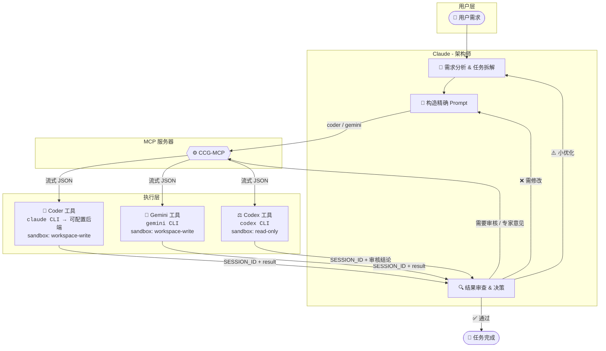

# Coder-Codex-Gemini (CCG)

<div align="center">


[English Docs](README_EN.md)

**Claude + Coder + Codex + Gemini 多模型协作框架**

让 **Claude/Sisyphus** 作为架构师调度 **Coder** 执行代码任务、**Codex** 审核代码质量，**Gemini** 提供专家咨询，<br>形成**自动化的多方协作闭环**。

**支持 Claude Code (MCP) 和 OpenCode (Oh-My-OpenCode) 两种运行环境**

[快速开始](#-快速开始) • [核心特性](#-核心特性) • [架构说明](#-架构说明) • [工具详解](#️-工具详解) • [OpenCode 配置](#-opencode-配置)

</div>

---

## 🌟 核心特性

CCG 通过连接多个顶级模型，构建了一个高效、低成本且高质量的代码生成与审核流水线：

| 维度 | 价值说明 |
| :--- | :--- |
| **🧠 成本优化** | **Claude/Sisyphus** 负责高智商思考与调度（贵但强），**Coder** 负责繁重的代码执行（量大管饱）。 |
| **🧩 能力互补** | **Claude** 补足 **Coder** 的创造力短板，**Codex** 提供独立的第三方审核视角，**Gemini** 提供多元化专家意见。 |
| **🛡️ 质量保障** | 引入双重审核机制：**Claude 初审** + **Codex 终审**，确保代码健壮性。 |
| **🔄 全自动闭环** | 支持 `拆解` → `执行` → `审核` → `重试` 的全自动流程，最大程度减少人工干预。 |
| **🔧 灵活架构** | 支持 **Claude Code (MCP)** 和 **OpenCode (Oh-My-OpenCode)** 两种运行环境，按需选择。 |
| **🔄 上下文保持** | **SESSION_ID** 会话复用机制确保多轮协作上下文连贯，支持长任务稳定执行，无信息丢失。 |

### 🔀 两种运行环境

| 特性 | Claude Code (MCP) | OpenCode (Oh-My-OpenCode) |
|------|-------------------|---------------------------|
| **架构师** | Claude | Sisyphus (Claude Opus) |
| **工具调用** | MCP 协议 | 子代理委托 |
| **Coder** | claude CLI + 可配置后端 | document-writer 代理 |
| **Codex** | codex CLI | oracle 代理 |
| **Gemini** | gemini CLI | frontend-ui-ux-engineer 代理 |
| **适用场景** | Claude Code 用户 | 偏好开源、多 LLM 提供商 |
| **配置复杂度** | 中等 | 较高 |

## 🤖 角色分工与协作

在这个体系中，每个模型都有明确的职责：

*   **Claude**: 👑 **架构师 / 协调者**
    *   负责需求分析、任务拆解、Prompt 优化以及最终决策。
*   **Coder**: 🔨 **执行者**
    *   指代那些**量大管饱、执行能力强**的模型（如 GLM-4.7、DeepSeek-V3 等）。
    *   可接入**任意支持 Claude Code API 的第三方模型**，负责具体的代码生成、修改、批量任务处理。
*   **Codex (OpenAI)**: ⚖️ **审核官 / 高级代码顾问**
    *   负责独立的代码质量把关，提供客观的 Code Review，也可作为架构设计和复杂方案的咨询顾问。
*   **Gemini**: 🧠 **多面手专家（可选）**
    *   与 Claude 同等级别的顶级 AI 专家，按需调用。可担任高阶顾问、独立审核者或代码执行者。

### 📊 实测案例

**[单元测试批量生成](cases/2025-01-05-unit-test-generation/README.md)** - CCG 架构实测记录

| 指标 | 纯 Claude 方案 | CCG 协作方案 | 说明 |
| :--- | :--- | :--- | :--- |
| **任务规模** | 7,488 行代码（481 个测试用例） | 7,488 行代码（481 个测试用例） | 为某后端项目生成单元测试 |
| **总成本** | $3.13 | $0.55 | **节省 82%** |
| **Claude 成本** | $3.13 | $0.29 | **节省 91%**（仅架构调度） |
| **Coder 成本** | $0 | $0.26 | 执行繁重代码生成任务 |
| **质量审核** | ❌ 无独立审核 | ✅ Claude 初审 + Codex 终审 | 双重把关，代码质量可控 |

**核心优势**：
- 💰 **成本优化**：Claude 只输出简短指令，利用便宜的输入价格处理验收工作，避免输出昂贵的代码 token
- 🔄 **上下文保持**：SESSION_ID 会话复用机制确保多轮协作上下文连贯，支持长任务稳定执行
- ⚡ **长任务稳定性**：优化的任务拆分与重试策略，确保大型任务（如批量生成 7,488 行测试代码）稳定完成
- 🛡️ **质量保障**：双重审核机制（Claude 初审 + Codex 终审），代码质量可控

### 协作流程图



**典型工作流**：

```
1. 用户提出需求
       ↓
2. Claude 分析、拆解任务，构造精确 Prompt
       ↓
3. 调用 coder (或 gemini) 工具 → 执行代码生成/修改
       ↓
4. Claude 审查结果，决定是否需要 Codex 审核或 Gemini 咨询
       ↓
5. 调用 codex (或 gemini) 工具 → 独立 Code Review / 获取第二意见
       ↓
6. 根据审核结论：通过 / 优化 / 重新执行
```

## 🚀 快速开始

### 1. 前置要求

在开始之前，请确保您已安装以下工具：

*   **uv**: 极速 Python 包管理器 ([安装指南](https://docs.astral.sh/uv/))
    *   Windows: `powershell -c "irm https://astral.sh/uv/install.ps1 | iex"`
    *   macOS/Linux: `curl -LsSf https://astral.sh/uv/install.sh | sh`
*   **Claude Code**: 版本 **≥ v2.0.56** ([安装指南](https://code.claude.com/docs))
*   **Codex CLI**: 版本 **≥ v0.61.0** ([安装指南](https://developers.openai.com/codex/quickstart))
*   **Gemini CLI**（可选）: 如需使用 Gemini 工具 ([安装指南](https://github.com/google-gemini/gemini-cli))
*   **Coder 后端 API Token**: 需自行配置，推荐使用 GLM-4.7 作为参考案例，从 [智谱 AI](https://open.bigmodel.cn) 获取。

> **⚠️ 重要提示：费用与权限**
> *   **工具授权**：`claude`、`codex` 和 `gemini` CLI 工具均需在本地完成登录授权。
> *   **费用说明**：这些工具的使用通常涉及官方订阅费用或 API 使用费。
>     *   **Claude Code**: 需要 Anthropic 账号及相应的计费设置。（或三方接入）
>     *   **Codex CLI**: 需要 OpenAI 账号或 API 额度。
>     *   **Gemini CLI**: 默认调用 `gemini-3-pro-preview` 模型（可能涉及 Google AI 订阅或 API 调用限制）。
>     *   **Coder API**: 需自行承担所配置后端模型（如智谱 AI、DeepSeek 等）的 API 调用费用。
> *   请在正式使用前确保所有工具已登录且账号资源充足。

### ⚡ 一键配置（推荐）

我们提供一键配置脚本，自动完成所有设置步骤：

**Windows（双击运行或终端执行）**
```powershell
git clone https://github.com/FredericMN/Coder-Codex-Gemini.git
cd Coder-Codex-Gemini
.\setup.bat
```

**macOS/Linux**
```bash
git clone https://github.com/FredericMN/Coder-Codex-Gemini.git
cd Coder-Codex-Gemini
chmod +x setup.sh && ./setup.sh
```

**脚本执行流程**：

1. **检查并安装 uv** - 如未安装则自动下载安装
2. **检查 Claude CLI** - 验证是否已安装
3. **安装项目依赖** - 运行 `uv sync`
4. **注册 MCP 服务器** - 自动配置到用户级别
5. **安装 Skills** - 复制工作流指导到 `~/.claude/skills/`
6. **配置全局 Prompt** - 自动追加到 `~/.claude/CLAUDE.md`
7. **配置 Coder** - 交互式输入 API Token、Base URL 和 Model

**🔐 安全说明**：
- API Token 输入时不会显示在屏幕上
- 配置文件保存在 `~/.ccg-mcp/config.toml`，权限设置为仅当前用户可读写
- Token 仅存储在本地，不会上传或共享

> 💡 **提示**：一键配置完成后，请重启 Claude Code CLI 使配置生效。

### Windows 用户注意事项

在 Windows 上使用 CCG-MCP，请确保以下 CLI 工具已正确添加到系统 PATH：

| 工具 | 验证命令 | 常见安装位置 |
|------|----------|--------------|
| `claude` | `where claude` | `%APPDATA%\npm\claude.cmd` 或通过 npm 全局安装 |
| `codex` | `where codex` | `%APPDATA%\npm\codex.cmd` 或通过 npm 全局安装 |
| `gemini` | `where gemini` | `%APPDATA%\npm\gemini.cmd` 或通过 npm 全局安装 |
| `uv` | `where uv` | `%USERPROFILE%\.local\bin\uv.exe` |

**添加到 PATH 的方法**：
1. 打开"系统属性" → "高级" → "环境变量"
2. 在"用户变量"中找到 `Path`，点击"编辑"
3. 添加工具所在目录（如 `%APPDATA%\npm`）
4. 重启终端使配置生效

**验证安装**：
```powershell
# 检查所有工具是否可用
claude --version
codex --version
gemini --version  # 可选
uv --version
```

> **提示**：如果遇到 "命令不存在" 错误，请检查 PATH 配置是否正确。

### 2. 安装 MCP 服务器

#### 远程安装（推荐）

一键脚本默认使用远程安装方式，无需额外操作。如需手动安装：

```bash
claude mcp add ccg -s user --transport stdio -- uvx --refresh --from git+https://github.com/FredericMN/Coder-Codex-Gemini.git ccg-mcp
```

#### 本地安装（仅开发调试）

如需修改源码或调试，可使用本地安装：

```bash
# 进入项目目录
cd /path/to/Coder-Codex-Gemini

# 安装依赖
uv sync

# 注册 MCP 服务器（使用本地路径）
# Windows
claude mcp add ccg -s user --transport stdio -- uv run --directory $pwd ccg-mcp

# macOS/Linux
claude mcp add ccg -s user --transport stdio -- uv run --directory $(pwd) ccg-mcp
```

#### 远程安装 vs 本地安装

| 特性 | 远程安装（推荐） | 本地安装 |
|------|-----------------|---------|
| **稳定性** | ✅ 每次独立拉取，无文件锁定问题 | ⚠️ 多终端并发可能冲突 |
| **适用场景** | 日常使用 | 开发调试 |
| **Skills 支持** | 需手动安装到 `~/.claude/skills/` | 需手动安装（或使用一键脚本） |
| **更新方式** | 自动获取最新版本 | 需手动 `git pull` |
| **依赖要求** | 需要 `git` 命令 | 仅需 `uv` |

> **⚠️ 注意**：本地安装时，如果多个终端同时调用 MCP，可能因文件锁定导致"MCP 无响应"。建议日常使用远程安装方式。

**卸载 MCP 服务器**
```bash
claude mcp remove ccg -s user
```

### 3. 配置 Coder

推荐使用 **配置文件** 方式进行管理。

> **可配置后端**：Coder 工具通过 Claude Code CLI 调用后端模型。**需要用户自行配置**，推荐使用 GLM-4.7 作为参考案例，您也可以选用其他支持 Claude Code API 的模型（如 Minimax、DeepSeek 等）。

**创建配置目录**:
```bash
# Windows
mkdir %USERPROFILE%\.ccg-mcp

# macOS/Linux
mkdir -p ~/.ccg-mcp
```

**创建配置文件** `~/.ccg-mcp/config.toml`:
```toml
[coder]
api_token = "your-api-token"  # 必填
base_url = "https://open.bigmodel.cn/api/anthropic"  # 示例：GLM API
model = "glm-4.7"  # 示例：GLM-4.7，可替换为其他模型

[coder.env]
CLAUDE_CODE_DISABLE_NONESSENTIAL_TRAFFIC = "1"
```

### 4. 安装 Skills（推荐）

Skills 层提供工作流指导，确保 Claude 正确使用 MCP 工具。

```bash
# Windows (PowerShell)
if (!(Test-Path "$env:USERPROFILE\.claude\skills")) { mkdir "$env:USERPROFILE\.claude\skills" }
xcopy /E /I "skills\ccg-workflow" "$env:USERPROFILE\.claude\skills\ccg-workflow"
# 可选：安装 Gemini 协作 Skill
xcopy /E /I "skills\gemini-collaboration" "$env:USERPROFILE\.claude\skills\gemini-collaboration"

# macOS/Linux
mkdir -p ~/.claude/skills
cp -r skills/ccg-workflow ~/.claude/skills/
# 可选：安装 Gemini 协作 Skill
cp -r skills/gemini-collaboration ~/.claude/skills/
```

### 5. 配置全局 Prompt（推荐）

在 `~/.claude/CLAUDE.md` 中添加强制规则，确保 Claude 遵守协作流程：

```markdown
# 全局协议

## 强制规则

- **默认协作**：所有代码/文档改动任务，**必须**委托 Coder 执行，阶段性完成后**必须**调用 Codex 审核
- **跳过需确认**：若判断无需协作，**必须立即暂停**并报告：
  > "这是一个简单的[描述]任务，我判断无需调用 Coder/Codex。是否同意？等待您的确认。"
- **违规即终止**：未经确认跳过 Coder 执行或 Codex 审核 = **流程违规**
- **必须会话复用**：必须保存接收到的 `SESSION_ID` ，并始终在请求参数中携带 `SESSION_ID` 保持上下文
- **SESSION_ID 管理规范**：各角色（Coder/Codex/Gemini）的 SESSION_ID 相互独立，必须使用 MCP 工具响应返回的实际 SESSION_ID 值，严禁自创 ID 或混用不同角色的 ID

## ⚠️ Skill 阅读前置条件（强制）

**在调用任何 CCG MCP 工具之前，必须先执行对应的 Skill 获取最佳实践指导：**

| MCP 工具 | 前置 Skill | 执行方式 |
|----------|-----------|---------|
| `mcp__ccg__coder` | `/ccg-workflow` | 必须先执行 |
| `mcp__ccg__codex` | `/ccg-workflow` | 必须先执行 |
| `mcp__ccg__gemini` | `/gemini-collaboration` | 必须先执行 |

**执行流程**：
1. 用户请求使用 Coder/Codex/Gemini
2. **立即执行对应 Skill**（如 `/ccg-workflow`、`/gemini-collaboration`）
3. 阅读 Skill 返回的指导内容
4. 按照指导调用 MCP 工具

**禁止行为**：
- ❌ 跳过 Skill 直接调用 MCP 工具
- ❌ 假设已了解最佳实践而不执行 Skill

---

# AI 协作体系

**Claude 是最终决策者**，所有 AI 意见仅供参考，需批判性思考后做出最优决策。

## 角色分工

| 角色 | 定位 | 用途 | sandbox | 重试 |
|------|------|------|---------|------|
| **Coder** | 代码执行者 | 生成/修改代码、批量任务 | workspace-write | 默认不重试 |
| **Codex** | 代码审核者/高阶顾问 | 架构设计、质量把关、Review | read-only | 默认 1 次 |
| **Gemini** | 高阶顾问（按需） | 架构设计、第二意见、前端/UI | workspace-write (yolo) | 默认 1 次 |

## 核心流程

1. **Coder 执行**：所有改动任务委托 Coder 处理
2. **Claude 验收**：Coder 完成后快速检查，有误则 Claude 自行修复
3. **Codex 审核**：阶段性开发完成后调用 review，有误委托 Coder 修复，持续迭代直至通过

## 任务拆分原则（分发给 Coder）

> ⚠️ **一次调用，一个目标**。禁止向 Coder 堆砌多个不相关需求。

- **精准 Prompt**：目标明确、上下文充分、验收标准清晰
- **按模块拆分**：相关改动可合并，独立模块分开
- **阶段性 Review**：每模块 Claude 验收，里程碑后 Codex 审核

## 编码前准备（复杂任务）

1. 搜索受影响的符号/入口点
2. 列出需要修改的文件清单
3. 复杂问题可先与 Codex 或 Gemini 沟通方案

## Gemini 触发场景

- **用户明确要求**：用户指定使用 Gemini
- **Claude 自主调用**：设计前端/UI、需要第二意见或独立视角时
```

> **说明**：纯 MCP 也能工作，但推荐 Skills + 全局 Prompt 配置以获得最佳体验。

### 6. 验证安装

运行以下命令检查 MCP 服务器状态：

```bash
claude mcp list
```

✅ 看到以下输出即表示安装成功：
```text
ccg: ... - ✓ Connected
```

### 7. (可选) 权限配置

为获得流畅体验，可在 `~/.claude/settings.json` 中添加自动授权：

```json
{
  "permissions": {
    "allow": [
      "mcp__ccg__coder",
      "mcp__ccg__codex",
      "mcp__ccg__gemini"
    ]
  }
}
```

## 🛠️ 工具详解

### `coder` - 代码执行者

调用可配置的后端模型执行具体的代码生成或修改任务。

> **可配置后端**：Coder 工具通过 Claude Code CLI 调用后端模型。**需要用户自行配置**，推荐使用 GLM-4.7 作为参考案例，您也可以选用其他支持 Claude Code API 的模型（如 Minimax、DeepSeek 等）。

| 参数 | 类型 | 必填 | 默认值 | 说明 |
| :--- | :--- | :---: | :--- | :--- |
| `PROMPT` | string | ✅ | - | 具体的任务指令和代码要求 |
| `cd` | Path | ✅ | - | 目标工作目录 |
| `sandbox` | string | - | `workspace-write` | 沙箱策略，默认允许写入 |
| `SESSION_ID` | string | - | `""` | 会话 ID，用于维持多轮对话上下文 |
| `return_all_messages` | bool | - | `false` | 是否返回完整的对话历史（用于调试） |
| `return_metrics` | bool | - | `false` | 是否在返回值中包含耗时等指标 |
| `timeout` | int | - | `300` | 空闲超时（秒），无输出超过此时间触发超时 |
| `max_duration` | int | - | `1800` | 总时长硬上限（秒），默认 30 分钟，0 表示无限制 |
| `max_retries` | int | - | `0` | 最大重试次数（Coder 默认不重试） |
| `log_metrics` | bool | - | `false` | 是否将指标输出到 stderr |

### `codex` - 代码审核者

调用 Codex 进行独立且严格的代码审查。

| 参数 | 类型 | 必填 | 默认值 | 说明 |
| :--- | :--- | :---: | :--- | :--- |
| `PROMPT` | string | ✅ | - | 审核任务描述 |
| `cd` | Path | ✅ | - | 目标工作目录 |
| `sandbox` | string | - | `read-only` | **强制只读**，严禁审核者修改代码 |
| `SESSION_ID` | string | - | `""` | 会话 ID |
| `skip_git_repo_check` | bool | - | `true` | 是否允许在非 Git 仓库运行 |
| `return_all_messages` | bool | - | `false` | 是否返回完整的对话历史（用于调试） |
| `image` | List[Path]| - | `[]` | 附加图片列表（用于 UI 审查等） |
| `model` | string | - | `""` | 指定模型，默认使用 Codex 自己的配置 |
| `return_metrics` | bool | - | `false` | 是否在返回值中包含耗时等指标 |
| `timeout` | int | - | `300` | 空闲超时（秒），无输出超过此时间触发超时 |
| `max_duration` | int | - | `1800` | 总时长硬上限（秒），默认 30 分钟，0 表示无限制 |
| `max_retries` | int | - | `1` | 最大重试次数（Codex 默认允许 1 次重试） |
| `log_metrics` | bool | - | `false` | 是否将指标输出到 stderr |
| `yolo` | bool | - | `false` | 无需审批运行所有命令（跳过沙箱） |
| `profile` | string | - | `""` | 从 ~/.codex/config.toml 加载的配置文件名称 |

### `gemini` - 多面手专家（可选）

调用 Gemini CLI 进行代码执行、技术咨询或代码审核。与 Claude 同等级别的顶级 AI 专家。

| 参数 | 类型 | 必填 | 默认值 | 说明 |
| :--- | :--- | :---: | :--- | :--- |
| `PROMPT` | string | ✅ | - | 任务指令，需提供充分背景信息 |
| `cd` | Path | ✅ | - | 工作目录 |
| `sandbox` | string | - | `workspace-write` | 沙箱策略，默认允许写入（灵活控制） |
| `yolo` | bool | - | `true` | 跳过审批，默认开启 |
| `SESSION_ID` | string | - | `""` | 会话 ID，用于多轮对话 |
| `model` | string | - | `gemini-3-pro-preview` | 指定模型版本 |
| `return_all_messages` | bool | - | `false` | 是否返回完整的对话历史 |
| `return_metrics` | bool | - | `false` | 是否在返回值中包含耗时等指标 |
| `timeout` | int | - | `300` | 空闲超时（秒） |
| `max_duration` | int | - | `1800` | 总时长硬上限（秒） |
| `max_retries` | int | - | `1` | 最大重试次数 |
| `log_metrics` | bool | - | `false` | 是否将指标输出到 stderr |

**角色定位**：
- 🧠 **高阶顾问**：架构设计、技术选型、复杂方案讨论
- ⚖️ **独立审核**：代码 Review、方案评审、质量把关
- 🔨 **代码执行**：原型开发、功能实现（尤其擅长前端/UI）

**触发场景**：
- 用户明确要求使用 Gemini
- Claude 需要第二意见或独立视角

### 超时机制

本项目采用**双重超时保护**机制：

| 超时类型 | 参数 | 默认值 | 说明 |
|----------|------|--------|------|
| **空闲超时** | `timeout` | 300s | 无输出超过此时间触发超时，有输出则重置计时器 |
| **总时长硬上限** | `max_duration` | 1800s | 从开始计时，无论是否有输出，超过此时间强制终止 |

**错误类型区分**：
- `idle_timeout`：空闲超时（无输出）
- `timeout`：总时长超时

### 返回值结构

```json
// 成功（默认行为，return_metrics=false）
{
  "success": true,
  "tool": "coder",
  "SESSION_ID": "uuid-string",
  "result": "回复内容"
}

// 成功（启用指标，return_metrics=true）
{
  "success": true,
  "tool": "coder",
  "SESSION_ID": "uuid-string",
  "result": "回复内容",
  "metrics": {
    "ts_start": "2026-01-02T10:00:00.000Z",
    "ts_end": "2026-01-02T10:00:05.123Z",
    "duration_ms": 5123,
    "tool": "coder",
    "sandbox": "workspace-write",
    "success": true,
    "retries": 0,
    "exit_code": 0,
    "prompt_chars": 256,
    "prompt_lines": 10,
    "result_chars": 1024,
    "result_lines": 50,
    "raw_output_lines": 60,
    "json_decode_errors": 0
  }
}

// 失败（结构化错误，默认行为）
{
  "success": false,
  "tool": "coder",
  "error": "错误摘要",
  "error_kind": "idle_timeout | timeout | upstream_error | ...",
  "error_detail": {
    "message": "错误简述",
    "exit_code": 1,
    "last_lines": ["最后20行输出..."],
    "idle_timeout_s": 300,
    "max_duration_s": 1800
    // "retries": 1  // 仅在 retries > 0 时返回
  }
}

// 失败（启用指标，return_metrics=true）
{
  "success": false,
  "tool": "coder",
  "error": "错误摘要",
  "error_kind": "idle_timeout | timeout | upstream_error | ...",
  "error_detail": {
    "message": "错误简述",
    "exit_code": 1,
    "last_lines": ["最后20行输出..."],
    "idle_timeout_s": 300,
    "max_duration_s": 1800
    // "retries": 1  // 仅在 retries > 0 时返回
  },
  "metrics": {
    "ts_start": "2026-01-02T10:00:00.000Z",
    "ts_end": "2026-01-02T10:00:05.123Z",
    "duration_ms": 5123,
    "tool": "coder",
    "sandbox": "workspace-write",
    "success": false,
    "retries": 0,
    "exit_code": 1,
    "prompt_chars": 256,
    "prompt_lines": 10,
    "json_decode_errors": 0
  }
}
```

## 📚 架构说明

### 三层配置架构（Claude Code）

本项目在 Claude Code 环境下采用 **MCP + Skills + 全局 Prompt** 混合架构，各层职责分明：

| 层级 | 职责 | Token 消耗 | 必需性 |
|------|------|-----------|--------|
| **MCP 层** | 工具实现（类型安全、结构化错误、重试、metrics） | 固定（工具 schema） | **必需** |
| **Skills 层** | 工作流指导（触发条件、流程、模板） | 按需加载 | 推荐 |
| **全局 Prompt 层** | 强制规则（确保 Claude 遵守协作流程） | 固定（约 20 行） | 推荐 |

**为什么推荐完整配置？**
- **纯 MCP**：工具可用，但 Claude 可能不理解何时/如何使用
- **+ Skills**：Claude 学会工作流程，知道何时触发协作
- **+ 全局 Prompt**：强制规则确保 Claude 始终遵守协作纪律

**Token 优化**：Skills 按需加载，非代码任务不加载工作流指导，可显著节约 Token

---

## 🔄 OpenCode 配置

> **OpenCode** 是 Claude Code 的开源替代方案，配合 **Oh-My-OpenCode** 插件可实现类似的多 Agent 编排效果。无需额外 MCP 及 SKILLS 支持。

### 适用场景

- 想要使用多种 LLM 提供商（Claude、GPT、Gemini）
- 需要多 Agent 并行协作
- 想要看到各个子代理的实时活动过程
- 偏好开源工具

### 🆕 新用户 vs 已安装用户

| 用户类型 | 推荐方式 | 说明 |
|----------|----------|------|
| **未安装 OpenCode** | 一键脚本 | 自动完成所有安装和配置 |
| **已安装 OpenCode + Oh-My-OpenCode** | 手动配置 | 参考模板文件，按需合并配置 |

> ⚠️ **已安装用户注意**：一键脚本会检测已存在的配置文件并询问是否覆盖。如选择覆盖，原文件会自动备份。建议选择跳过，然后手动合并所需配置。

### ⚡ 一键配置（全新用户推荐-未安装过OpenCode的用户）

**Windows（双击运行或终端执行）**
```powershell
git clone https://github.com/FredericMN/Coder-Codex-Gemini.git
cd Coder-Codex-Gemini
.\setup-opencode.bat
```

**macOS/Linux**
```bash
git clone https://github.com/FredericMN/Coder-Codex-Gemini.git
cd Coder-Codex-Gemini
chmod +x setup-opencode.sh && ./setup-opencode.sh
```

**脚本执行流程**：

1. **检查并安装依赖** - bun、opencode CLI
2. **安装 Oh-My-OpenCode** - 交互式选择订阅状态
3. **配置 opencode.json** - 模型定义和 API 配置
4. **配置 oh-my-opencode.json** - CCG 代理角色定义
5. **配置 AGENTS.md** - 协作协议

### 📝 手动配置（已安装用户推荐）

如果你已经安装了 OpenCode 和 Oh-My-OpenCode，建议参考以下模板文件手动合并配置：

| 模板文件 | 目标位置 | 说明 |
|----------|----------|------|
| [`templates/opencode/opencode.json`](templates/opencode/opencode.json) | `~/.config/opencode/opencode.json` | 模型和 API 配置 |
| [`templates/opencode/oh-my-opencode.json`](templates/opencode/oh-my-opencode.json) | `~/.config/opencode/oh-my-opencode.json` | 代理角色定义 |
| [`templates/opencode/AGENTS.md`](templates/opencode/AGENTS.md) | `~/.config/opencode/AGENTS.md` | 协作协议 |

#### 核心配置项

**1. `oh-my-opencode.json` - 代理角色定义（重点）**

主要需要配置的是各代理的 `prompt_append` 和 `model`：

> 💡 **关于 `prompt_append`**：这是"追加提示词"，会在 Oh-My-OpenCode 原有提示词的基础上追加 CCG 协作规则，不会覆盖原有的 OMO 提示词，最大程度保持兼容性。

```json
{
  "agents": {
    "Sisyphus": {
      "model": "anthropic/claude-opus-4-5-20251101",
      "prompt_append": "## CCG 协作规则\n\n你是架构师..."
    },
    "document-writer": {
      "model": "zhipuai-coding-plan/glm-4.7",
      "prompt_append": "## ⚠️ 身份确认：你是 Coder 子代理..."
    },
    "oracle": {
      "model": "openai/gpt-5.1-codex-mini",
      "prompt_append": "## ⚠️ 身份确认：你是 Codex 子代理..."
    },
    "frontend-ui-ux-engineer": {
      "model": "google/antigravity-gemini-3-pro-high",
      "prompt_append": "## ⚠️ 身份确认：你是 Gemini 子代理..."
    }
  }
}
```

- **`prompt_append`**：定义各代理的角色行为规范，是 CCG 协作的核心
- **`model`**：可按需调整为你订阅的模型

**2. `opencode.json` - 模型和 API 配置**

我个人的使用场景下，大部分模型（OpenAI、Google、Zhipu）通过 OAuth 订阅或者官方API认证，无需额外配置 URL/API。

**需要配置第三方中转的案例**（OpenAI、Claude等模型均适用）：

```json
{
  "provider": {
    "anthropic": {
      "options": {
        "baseURL": "https://your-proxy-api.com/v1",
        "apiKey": "your-api-key"
      },
      "models": {
        "claude-opus-4-5-20251101": { "name": "claude-opus-4-5-20251101" }
      }
    }
  }
}
```

#### ⚠️ 第三方 API 中转注意事项

使用第三方 API 中转时，**模型名称的键（key）必须与中转站支持的模型名称完全一致**：

```json
// ✅ 正确：键名与中转站支持的模型名一致
"models": {
  "claude-opus-4-5-20251101": { "name": "claude-opus-4-5-20251101" }
}

// ❌ 错误：键名与中转站不匹配，会导致调用失败
"models": {
  "my-custom-name": { "name": "claude-opus-4-5-20251101" }
}
```

**配置前请确认**：
1. 你的中转站支持哪些模型名称
2. 将 `models` 下的键名设置为中转站支持的确切名称
3. 在 `oh-my-opencode.json` 中引用时使用 `provider/model-key` 格式（如 `anthropic/claude-opus-4-5-20251101`）

### 代理角色映射（模板配置，具体模型可以自由更换）

| CCG 角色 | OpenCode 代理 | 模型 | 职责 |
|----------|---------------|------|------|
| **架构师** | Sisyphus | Claude Opus 4.5 | 需求分析、任务拆解、最终决策 |
| **Coder** | document-writer | GLM-4.7 | 代码生成、文档修改、批量任务 |
| **Codex** | oracle | GPT-5.1 Codex Mini | 代码审核、架构咨询、质量把关 |
| **Gemini** | frontend-ui-ux-engineer | Gemini 3 Pro High | 前端/UI、第二意见、独立视角 |

### 认证配置

安装完成后，需要为各提供商完成认证：

```bash
# 1. Anthropic (Claude)
opencode auth login
# → Select: Anthropic → Claude Pro/Max

# 2. OpenAI (ChatGPT/Codex)
opencode auth login
# → Select: OpenAI → ChatGPT Plus/Pro (Codex Subscription)

# 3. Google (Gemini)
opencode auth login
# → Select: Google → OAuth with Google (Antigravity)
```

> ⚠️ **重要**：使用 Antigravity 插件时，必须在 `oh-my-opencode.json` 中设置 `"google_auth": false`

### 快捷键

| 快捷键 | 功能 |
|:-------|:-----|
| `Tab` | 切换 build/plan 模式 |
| `Ctrl+X` 然后 `B` | 切换 Sidebar |
| `Ctrl+X` 然后 `→/←` | 切换子任务 |
| `Ctrl+X` 然后 `↑` | 返回主任务 |
| `Ctrl+P` | 命令面板 |

---

## 🧑‍💻 开发与贡献

欢迎提交 Issue 和 Pull Request！

```bash
# 1. 克隆仓库
git clone https://github.com/FredericMN/Coder-Codex-Gemini.git
cd Coder-Codex-Gemini

# 2. 安装依赖 (使用 uv)
uv sync

# 3. 本地调试运行
uv run ccg-mcp
```

## 📚 参考资源

- **FastMCP**: [GitHub](https://github.com/jlowin/fastmcp) - 高效的 MCP 框架
- **GLM API**: [智谱 AI](https://open.bigmodel.cn) - 强大的国产大模型（推荐作为 Coder 后端）
- **Claude Code**: [Documentation](https://docs.anthropic.com/en/docs/claude-code)
- **OpenCode**: [官方文档](https://opencode.ai/docs) - 开源 AI Coding Agent
- **Oh-My-OpenCode**: [GitHub](https://github.com/code-yeongyu/oh-my-opencode) - OpenCode 多代理编排插件

## 📄 License

MIT
