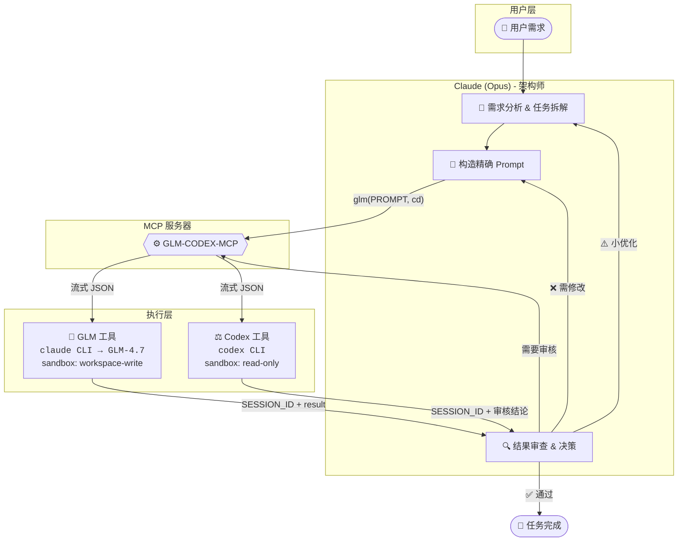

# GLM-CODEX-MCP

<div align="center">


[English Docs](README_EN.md)

**Claude (Opus) + GLM + Codex 三方协作 MCP 服务器**

让 **Claude (Opus)** 作为架构师调度 **GLM** 执行代码任务、**Codex** 审核代码质量，<br>形成**自动化的三方协作闭环**。

[快速开始](#快速开始) • [核心特性](#核心特性) • [配置指南](#配置指南) • [工具详解](#工具详解)

</div>

---

## 🌟 核心特性

GLM-CODEX-MCP 通过连接三大模型，构建了一个高效、低成本且高质量的代码生成与审核流水线：

| 维度 | 价值说明 |
| :--- | :--- |
| **🧠 成本优化** | **Opus** 负责高智商思考与调度（贵但强），**GLM** 负责繁重的代码执行（量大管饱）。 |
| **🧩 能力互补** | **Opus** 补足 **GLM** 的创造力短板，**Codex** 提供独立的第三方审核视角。 |
| **🛡️ 质量保障** | 引入双重审核机制：**Claude 初审** + **Codex 终审**，确保代码健壮性。 |
| **🔄 全自动闭环** | 支持 `拆解` → `执行` → `审核` → `重试` 的全自动流程，最大程度减少人工干预。 |

## 🤖 角色分工与协作

在这个体系中，每个模型都有明确的职责：

*   **Claude (Opus)**: 👑 **架构师 / 协调者**
    *   负责需求分析、任务拆解、Prompt 优化以及最终决策。
*   **GLM-4.7**: 🔨 **执行者**
    *   负责具体的代码生成、修改、批量任务处理。
*   **Codex (OpenAI)**: ⚖️ **审核官**
    *   负责独立的代码质量把关，提供客观的 Code Review。

### 协作流程图



**典型工作流**：

```
1. 用户提出需求
       ↓
2. Claude 分析、拆解任务，构造精确 Prompt
       ↓
3. 调用 glm 工具 → GLM-4.7 执行代码生成/修改
       ↓
4. Claude 审查结果，决定是否需要 Codex 审核
       ↓
5. 调用 codex 工具 → Codex 独立 Code Review
       ↓
6. 根据审核结论：通过 / 优化 / 重新执行
```

## 🚀 快速开始

### 1. 前置要求

在开始之前，请确保您已安装以下工具：

*   **uv**: 极速 Python 包管理器 ([安装指南](https://docs.astral.sh/uv/))
    *   Windows: `powershell -c "irm https://astral.sh/uv/install.ps1 | iex"`
    *   macOS/Linux: `curl -LsSf https://astral.sh/uv/install.sh | sh`
*   **Claude Code**: 版本 **≥ v2.0.56** ([安装指南](https://code.claude.com/docs))
*   **Codex CLI**: 版本 **≥ v0.61.0** ([安装指南](https://developers.openai.com/codex/quickstart))
*   **GLM API Token**: 从 [智谱 AI](https://open.bigmodel.cn) 获取。

### 2. 安装 MCP 服务器

我们只需安装本项目 `glm-codex-mcp` 即可。它内部集成了对系统 `codex` 命令的调用。

```bash
claude mcp add glm-codex -s user --transport stdio -- uvx --refresh --from git+https://github.com/FredericMN/GLM-CODEX-MCP.git glm-codex-mcp
```

### 3. 配置 GLM

推荐使用 **配置文件** 方式进行管理。

**创建配置目录**:
```bash
# Windows
mkdir %USERPROFILE%\.glm-codex-mcp

# macOS/Linux
mkdir -p ~/.glm-codex-mcp
```

**创建配置文件** `~/.glm-codex-mcp/config.toml`:
```toml
[glm]
api_token = "your-glm-api-token"  # 必填
base_url = "https://open.bigmodel.cn/api/anthropic"
model = "glm-4.7"

[glm.env]
CLAUDE_CODE_DISABLE_NONESSENTIAL_TRAFFIC = "1"
```

### 4. 验证安装

运行以下命令检查 MCP 服务器状态：

```bash
claude mcp list
```

✅ 看到以下输出即表示安装成功：
```text
glm-codex: ... - ✓ Connected
```

### 5. (可选) 权限配置

为获得流畅体验，可在 `~/.claude/settings.json` 中添加自动授权：

```json
{
  "permissions": {
    "allow": [
      "mcp__glm-codex__glm",
      "mcp__glm-codex__codex"
    ]
  }
}
```

## 🛠️ 工具详解

### `glm` - 代码执行者

调用 GLM-4.7 模型执行具体的代码生成或修改任务。

| 参数 | 类型 | 必填 | 默认值 | 说明 |
| :--- | :--- | :---: | :--- | :--- |
| `PROMPT` | string | ✅ | - | 具体的任务指令和代码要求 |
| `cd` | Path | ✅ | - | 目标工作目录 |
| `sandbox` | string | - | `workspace-write` | 沙箱策略，默认允许写入 |
| `SESSION_ID` | string | - | `""` | 会话 ID，用于维持多轮对话上下文 |
| `return_all_messages` | bool | - | `false` | 是否返回完整的对话历史（用于调试） |
| `return_metrics` | bool | - | `true` | 是否在返回值中包含耗时等指标 |
| `timeout` | int | - | `300` | 空闲超时（秒），无输出超过此时间触发超时 |
| `max_duration` | int | - | `1800` | 总时长硬上限（秒），默认 30 分钟，0 表示无限制 |
| `max_retries` | int | - | `0` | 最大重试次数（GLM 默认不重试） |
| `log_metrics` | bool | - | `false` | 是否将指标输出到 stderr |

### `codex` - 代码审核者

调用 Codex 进行独立且严格的代码审查。

| 参数 | 类型 | 必填 | 默认值 | 说明 |
| :--- | :--- | :---: | :--- | :--- |
| `PROMPT` | string | ✅ | - | 审核任务描述 |
| `cd` | Path | ✅ | - | 目标工作目录 |
| `sandbox` | string | - | `read-only` | **强制只读**，严禁审核者修改代码 |
| `SESSION_ID` | string | - | `""` | 会话 ID |
| `skip_git_repo_check` | bool | - | `true` | 是否允许在非 Git 仓库运行 |
| `return_all_messages` | bool | - | `false` | 是否返回完整的对话历史（用于调试） |
| `image` | List[Path]| - | `[]` | 附加图片列表（用于 UI 审查等） |
| `model` | string | - | `""` | 指定模型，默认使用 Codex 自己的配置 |
| `return_metrics` | bool | - | `true` | 是否在返回值中包含耗时等指标 |
| `timeout` | int | - | `300` | 空闲超时（秒），无输出超过此时间触发超时 |
| `max_duration` | int | - | `1800` | 总时长硬上限（秒），默认 30 分钟，0 表示无限制 |
| `max_retries` | int | - | `1` | 最大重试次数（Codex 默认允许 1 次重试） |
| `log_metrics` | bool | - | `false` | 是否将指标输出到 stderr |
| `yolo` | bool | - | `false` | 无需审批运行所有命令（跳过沙箱） |
| `profile` | string | - | `""` | 从 ~/.codex/config.toml 加载的配置文件名称 |

### 超时机制

本项目采用**双重超时保护**机制：

| 超时类型 | 参数 | 默认值 | 说明 |
|----------|------|--------|------|
| **空闲超时** | `timeout` | 300s | 无输出超过此时间触发超时，有输出则重置计时器 |
| **总时长硬上限** | `max_duration` | 1800s | 从开始计时，无论是否有输出，超过此时间强制终止 |

**错误类型区分**：
- `idle_timeout`：空闲超时（无输出）
- `timeout`：总时长超时

### 返回值结构

```json
// 成功（return_metrics 默认为 true）
{
  "success": true,
  "tool": "glm",
  "SESSION_ID": "uuid-string",
  "result": "回复内容",
  "metrics": {
    "ts_start": "2026-01-02T10:00:00.000Z",
    "ts_end": "2026-01-02T10:00:05.123Z",
    "duration_ms": 5123,
    "tool": "glm",
    "sandbox": "workspace-write",
    "success": true,
    "retries": 0,
    "exit_code": 0,
    "prompt_chars": 256,
    "prompt_lines": 10,
    "result_chars": 1024,
    "result_lines": 50,
    "raw_output_lines": 60,
    "json_decode_errors": 0
  }
}

// 失败（结构化错误）
{
  "success": false,
  "tool": "glm",
  "error": "错误摘要",
  "error_kind": "idle_timeout | timeout | upstream_error | ...",
  "error_detail": {
    "message": "错误简述",
    "exit_code": 1,
    "last_lines": ["最后20行输出..."],
    "idle_timeout_s": 300,
    "max_duration_s": 1800,
    "retries": 0
  },
  "metrics": { ... }
}
```

## 📝 提示词配置

本项目提供两种提示词配置方案，根据你的需求选择：

| 方案 | 适用场景 | Token 消耗 | 配置复杂度 |
|------|----------|-----------|-----------|
| **Skill 方案** | 推荐，按需加载 | 低 | 需安装 Skill |
| **传统方案** | 简单直接 | 较高 | 仅需编辑 CLAUDE.md |

---

### 方案一：Skill 方案（推荐）

使用 Claude Code Skill 实现按需加载，仅在代码任务时触发，节约 Token。

**安装 Skill**：

```bash
# 复制 Skill 文件到 Claude Code 目录

# Windows (PowerShell)
if (!(Test-Path "$env:USERPROFILE\.claude\skills")) { mkdir "$env:USERPROFILE\.claude\skills" }
xcopy /E /I "skills\glm-codex-workflow" "$env:USERPROFILE\.claude\skills\glm-codex-workflow"

# macOS/Linux
mkdir -p ~/.claude/skills
cp -r skills/glm-codex-workflow ~/.claude/skills/
```

**配置精简版 CLAUDE.md**（添加到 `~/.claude/CLAUDE.md`）：

```markdown
# 全局配置

## GLM-CODEX 协作

GLM 是你的代码执行者，Codex 是你的代码审核者。**所有代码决策权归你（Claude）所有**。

当进行代码开发任务时，会自动触发 `glm-codex-workflow` Skill，提供详细协作指南。

### 快速参考

- **GLM**：代码生成/修改，`sandbox=workspace-write`
- **Codex**：代码审核，`sandbox=read-only`（严禁修改）
- **会话复用**：保存 `SESSION_ID` 保持上下文

### 核心原则

1. **所有代码任务均建议调用 GLM 执行**，GLM 执行完毕后快速验收再执行下一任务
2. GLM/Codex 意见仅供参考，你必须独立判断
3. 编码后推荐调用 Codex review
4. 若 Codex 指出问题，修复后再次 review

### 重试与错误处理

- **Codex**：默认允许 1 次重试（只读操作无副作用）
- **GLM**：默认不重试（有写入副作用），可通过 `max_retries` 显式启用
- **结构化错误**：失败时返回 `error_kind` 和 `error_detail` 便于排障

### 编码前准备（推荐）

复杂任务调用 GLM 前，建议：
1. 全局搜索受影响的符号/入口点（如：`grep "函数名" -r`）
2. 列出所有需要修改的文件
3. 在 PROMPT 中明确"修复/开发清单"
4. **复杂任务建议先和 Codex 沟通，明确方案细节后再委托 GLM 执行**

这样可以提高 GLM 的执行精度，减少遗漏。
```

**优势**：
- 非代码任务不加载协作指南（约 180 行 → 20 行，估算节约 ~80% Token）
- 代码任务自动触发，无需手动调用
- 详细规范按需读取，渐进式披露

---

### 方案二：传统方案

直接将完整提示词添加到 CLAUDE.md，每次对话都加载。

<details>
<summary>点击展开完整提示词配置</summary>

````markdown
# GLM-CODEX-MCP 协作指南

## 核心规则

GLM 是你的代码执行者，Codex 是你的代码审核者。**所有代码决策权归你（Claude）所有**。

**角色分工**：
- 你（Claude/Opus）：架构师 + 协调者 + 最终决策者
- GLM-4.7：代码执行者（量大管饱，执行力强）
- Codex：独立审核者（第三方视角，质量把关）

## 协作流程

**1. 编码前（可选）**

复杂任务可先自行分析拆解，明确方案后再委托 GLM 执行。

**2. 编码中**

- **简单任务**：优先调用 GLM 执行
- **批量/重复/复杂任务**：调用 GLM 执行，你负责给出清晰、精确的 Prompt
- **需求不明确**：先理解、拆解，再委托 GLM 执行
- **GLM 执行完毕后**：快速确认结果，发现问题立即修复，无问题则继续下一任务

**3. 编码后（推荐）**

整体改动或阶段性开发完成后，**调用 Codex 进行 review**：
- 检查代码质量（可读性、可维护性、潜在 bug）
- 评估需求完成度
- 给出明确结论：✅ 通过 / ⚠️ 建议优化 / ❌ 需要修改

**若 Codex 指出需修复的问题**：修复后再次调用 Codex review，持续迭代直到通过

**4. 独立判断**

Codex 和 GLM 的意见**仅供参考**。你必须有自己的判断，合理分析采纳建议，不盲从。

## 工具调用规范

### GLM 工具（代码执行）

**调用时机**：批量代码生成、重复性修改、明确定义的功能实现

**参数**：
- PROMPT (string, 必填): 任务指令
- cd (Path, 必填): 工作目录
- sandbox (string): 沙箱策略，默认 `workspace-write`
- SESSION_ID (string): 会话 ID，用于多轮对话，默认空字符串（开启新会话）
- return_all_messages (boolean): 返回完整消息，默认 False

> **提示**：同类开发任务或问题修复应尽量保持同一会话（复用 SESSION_ID），让 GLM 保持上下文连贯性。

**返回值**：
```json
// 成功时
{
  "success": true,
  "tool": "glm",
  "SESSION_ID": "uuid-string",  // ← 保存此值用于后续对话
  "result": "GLM回复的文本内容"
}

// 失败时
{
  "success": false,
  "tool": "glm",
  "error": "错误信息"
}
```

**Prompt 模板**：
```
[SYSTEM] 你是 GLM-4.7，负责执行代码任务。请直接开始工作，不要询问用户。

请执行以下代码任务：

**任务类型**：[新增功能 / 修复 Bug / 重构 / 其他]
**目标文件**：[文件路径]

**具体要求**：
1. [要求1]
2. [要求2]

**约束条件**：
- [约束1，如：仅修改 X 函数，不要动其他部分]
- [约束2，如：保持 API 签名不变]

**验收标准**：
- [标准1，如：性能不劣化]

请严格按照上述范围修改代码，完成后说明改动内容。
```

**使用规范**：
- **必须保存** `SESSION_ID` 以便多轮对话
- 检查 `success` 字段判断执行是否成功
- 从 `result` 字段获取 GLM 的回复内容
- 调试时设置 `return_all_messages=True` 获取 `all_messages` 详细过程

### Codex 工具（代码审核）

**调用时机**：代码改动完成后，需要独立审核时

**参数**：
- PROMPT (string, 必填): 审核任务描述
- cd (Path, 必填): 工作目录
- sandbox (string): 沙箱策略，**必须** `read-only`（严禁修改代码）
- SESSION_ID (string): 会话 ID，用于多轮对话，默认空字符串（开启新会话）
- return_all_messages (boolean): 返回完整消息，默认 False
- skip_git_repo_check (boolean): 允许非 Git 仓库，默认 True
- image (List[Path]): 附加图片文件路径列表，默认空列表
- model (string): 指定模型，默认使用 Codex 自己的配置
- yolo (boolean): 无需审批运行所有命令，默认 False
- profile (string): 配置文件名称，默认使用默认配置

**返回值**：
```json
// 成功时
{
  "success": true,
  "tool": "codex",
  "SESSION_ID": "uuid-string",  // ← 保存此值用于后续对话
  "result": "Codex回复的文本内容"
}

// 失败时
{
  "success": false,
  "tool": "codex",
  "error": "错误信息"
}
```

**Prompt 模板**：
```
请 review 以下代码改动：

**改动文件**：[文件列表]
**改动目的**：[简要描述]

**请检查**：
1. 代码质量（可读性、可维护性）
2. 潜在 Bug 或边界情况
3. 需求完成度

**请给出明确结论**：
- ✅ 通过：代码质量良好，可以合入
- ⚠️ 建议优化：[具体建议]
- ❌ 需要修改：[具体问题]
```

**使用规范**：
- **严格边界**：必须使用 `sandbox="read-only"`，Codex 严禁修改代码
- **必须保存** `SESSION_ID` 以便多轮对话
- 检查 `success` 字段判断审核是否成功
- 从 `result` 字段获取 Codex 的审核结论
- 调试时设置 `return_all_messages=True` 获取 `all_messages` 详细过程

## 推荐用法

**Codex 工具**（审核）：
- 如需详细追踪推理过程，设置 `return_all_messages=True`
- 用于精准定位问题、debug、代码审核

**GLM 工具**（执行）：
- 如需详细追踪执行过程，设置 `return_all_messages=True`
- 用于批量代码生成、重复性修改、代码原型快速编写

## 注意事项

- **严格边界**：Codex 默认 `sandbox=read-only`，严禁修改代码，仅提供 diff 建议
- **GLM 可写**：GLM 默认 `sandbox=workspace-write`，允许修改代码
- **会话管理**：每次调用后保存 `SESSION_ID` 以便多轮对话
- **工作目录**：确保 `cd` 参数指向正确的项目目录
- **独立思考**：对工具的建议要有自己的判断，不盲从
- **工具识别**：通过 `tool` 字段区分是 `glm` 还是 `codex` 的返回
````

</details>

## 🧑‍💻 开发与贡献

欢迎提交 Issue 和 Pull Request！

```bash
# 1. 克隆仓库
git clone https://github.com/FredericMN/GLM-CODEX-MCP.git
cd GLM-CODEX-MCP

# 2. 安装依赖 (使用 uv)
uv sync

# 3. 运行测试
uv run pytest

# 4. 本地调试运行
uv run glm-codex-mcp
```

## 📚 参考资源

- **CodexMCP**: [GitHub](https://github.com/GuDaStudio/codexmcp) - 核心参考实现
- **FastMCP**: [GitHub](https://github.com/jlowin/fastmcp) - 高效的 MCP 框架
- **GLM API**: [智谱 AI](https://open.bigmodel.cn) - 强大的国产大模型
- **Claude Code**: [Documentation](https://docs.anthropic.com/en/docs/claude-code)

## 📄 License

MIT