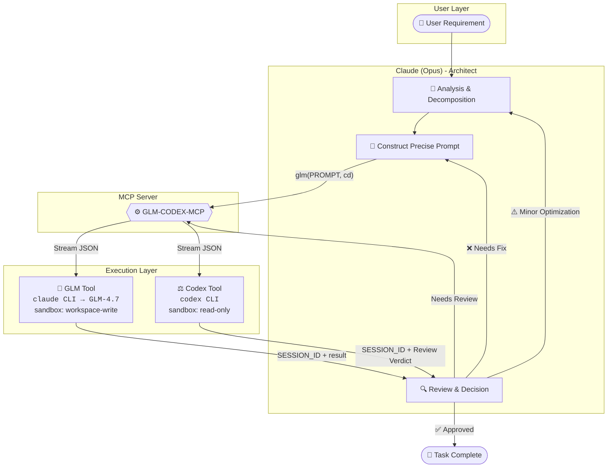

# GLM-CODEX-MCP

<div align="center">


**Claude (Opus) + GLM + Codex Collaborative MCP Server**

[中文文档](README.md)

Empower **Claude (Opus)** as the architect to orchestrate **GLM** for code execution tasks and **Codex** for code quality review,<br>forming an **automated tripartite collaboration loop**.

[Quick Start](#quick-start) • [Core Features](#core-features) • [Configuration](#configuration) • [Tools](#tools)

</div>

---

## 🌟 Core Features

GLM-CODEX-MCP connects three major models to build an efficient, cost-effective, and high-quality pipeline for code generation and review:

| Dimension | Value Proposition |
| :--- | :--- |
| **🧠 Cost Optimization** | **Opus** handles high-intelligence reasoning & orchestration (expensive but powerful), while **GLM** handles heavy lifting of code execution (cost-effective volume). |
| **🧩 Complementary Capabilities** | **Opus** compensates for **GLM**'s creativity gaps, and **Codex** provides an independent third-party review perspective. |
| **🛡️ Quality Assurance** | Introduces a dual-review mechanism: **Claude Initial Review** + **Codex Final Review** to ensure code robustness. |
| **🔄 Fully Automated Loop** | Supports a fully automated flow of `Decompose` → `Execute` → `Review` → `Retry`, minimizing human intervention. |

## 🤖 Roles & Collaboration

In this system, each model has a clear responsibility:

*   **Claude (Opus)**: 👑 **Architect / Coordinator**
    *   Responsible for requirement analysis, task decomposition, prompt optimization, and final decision-making.
*   **GLM-4.7**: 🔨 **Executor**
    *   Responsible for concrete code generation, modification, and batch task processing.
*   **Codex (OpenAI)**: ⚖️ **Reviewer / Senior Code Consultant**
    *   Responsible for independent code quality control, providing objective Code Reviews, and serving as a consultant for architecture design and complex solutions.

### Collaboration Workflow



**Typical Workflow**:

```
1. User submits a requirement
       ↓
2. Claude analyzes, decomposes tasks, constructs precise Prompt
       ↓
3. Calls glm tool → GLM-4.7 executes code generation/modification
       ↓
4. Claude reviews results, decides if Codex review is needed
       ↓
5. Calls codex tool → Codex performs independent Code Review
       ↓
6. Based on verdict: Approve / Optimize / Re-execute
```

## 🚀 Quick Start

### 1. Prerequisites

Before starting, ensure you have installed the following tools:

*   **uv**: Blazing fast Python package manager ([Installation Guide](https://docs.astral.sh/uv/))
    *   Windows: `powershell -c "irm https://astral.sh/uv/install.ps1 | iex"`
    *   macOS/Linux: `curl -LsSf https://astral.sh/uv/install.sh | sh`
*   **Claude Code**: Version **≥ v2.0.56** ([Installation Guide](https://code.claude.com/docs))
*   **Codex CLI**: Version **≥ v0.61.0** ([Installation Guide](https://developers.openai.com/codex/quickstart))
*   **GLM API Token**: Get from [Zhipu AI](https://open.bigmodel.cn).

### 2. Install MCP Server

You only need to install this project `glm-codex-mcp`. It integrates calls to the system `codex` command internally.

```bash
claude mcp add glm-codex -s user --transport stdio -- uvx --refresh --from git+https://github.com/FredericMN/GLM-CODEX-MCP.git glm-codex-mcp
```

### 3. Configure GLM

It is recommended to use the **Configuration File** method for management.

**Create Configuration Directory**:
```bash
# Windows
mkdir %USERPROFILE%\.glm-codex-mcp

# macOS/Linux
mkdir -p ~/.glm-codex-mcp
```

**Create Configuration File** `~/.glm-codex-mcp/config.toml`:
```toml
[glm]
api_token = "your-glm-api-token"  # Required
base_url = "https://open.bigmodel.cn/api/anthropic"
model = "glm-4.7"

[glm.env]
CLAUDE_CODE_DISABLE_NONESSENTIAL_TRAFFIC = "1"
```

### 4. Verify Installation

Run the following command to check MCP server status:

```bash
claude mcp list
```

✅ Seeing the following output means installation is successful:
```text
glm-codex: ... - ✓ Connected
```

### 5. (Optional) Permission Configuration

For a smoother experience, add automatic authorization in `~/.claude/settings.json`:

```json
{
  "permissions": {
    "allow": [
      "mcp__glm-codex__glm",
      "mcp__glm-codex__codex"
    ]
  }
}
```

## 🛠️ Tools Details

### `glm` - Code Executor

Calls the GLM-4.7 model to execute specific code generation or modification tasks.

| Parameter | Type | Required | Default | Description |
| :--- | :--- | :---: | :--- | :--- |
| `PROMPT` | string | ✅ | - | Specific task instructions and code requirements |
| `cd` | Path | ✅ | - | Target working directory |
| `sandbox` | string | - | `workspace-write` | Sandbox policy, write allowed by default |
| `SESSION_ID` | string | - | `""` | Session ID, used to maintain multi-turn context |
| `return_all_messages` | bool | - | `false` | Whether to return full conversation history (for debugging) |
| `return_metrics` | bool | - | `false` | Whether to include metrics in return value |
| `timeout` | int | - | `300` | Idle timeout (seconds), triggers when no output for this duration |
| `max_duration` | int | - | `1800` | Max duration limit (seconds), default 30 min, 0 for unlimited |
| `max_retries` | int | - | `0` | Max retry count (GLM defaults to no retry) |
| `log_metrics` | bool | - | `false` | Whether to output metrics to stderr |

### `codex` - Code Reviewer

Calls Codex for independent and strict code review.

| Parameter | Type | Required | Default | Description |
| :--- | :--- | :---: | :--- | :--- |
| `PROMPT` | string | ✅ | - | Review task description |
| `cd` | Path | ✅ | - | Target working directory |
| `sandbox` | string | - | `read-only` | **Forced Read-Only**, reviewer forbidden from modifying code |
| `SESSION_ID` | string | - | `""` | Session ID |
| `skip_git_repo_check` | bool | - | `true` | Whether to allow running in non-Git repositories |
| `return_all_messages` | bool | - | `false` | Whether to return full conversation history (for debugging) |
| `image` | List[Path]| - | `[]` | List of additional images (for UI review, etc.) |
| `model` | string | - | `""` | Specify model, defaults to Codex's own config |
| `return_metrics` | bool | - | `false` | Whether to include metrics in return value |
| `timeout` | int | - | `300` | Idle timeout (seconds), triggers when no output for this duration |
| `max_duration` | int | - | `1800` | Max duration limit (seconds), default 30 min, 0 for unlimited |
| `max_retries` | int | - | `1` | Max retry count (Codex defaults to 1 retry) |
| `log_metrics` | bool | - | `false` | Whether to output metrics to stderr |
| `yolo` | bool | - | `false` | Run all commands without approval (skip sandbox) |
| `profile` | string | - | `""` | Config profile name from ~/.codex/config.toml |

### Timeout Mechanism

This project uses a **dual timeout protection** mechanism:

| Timeout Type | Parameter | Default | Description |
|--------------|-----------|---------|-------------|
| **Idle Timeout** | `timeout` | 300s | Triggers when no output for this duration; resets on activity |
| **Max Duration** | `max_duration` | 1800s | Hard limit from start, forcibly terminates regardless of output |

**Error Type Distinction**:
- `idle_timeout`: Idle timeout (no output)
- `timeout`: Total duration timeout

## 📝 Prompt Configuration

This project provides two prompt configuration options:

| Option | Use Case | Token Usage | Setup Complexity |
|--------|----------|-------------|------------------|
| **Skill Option** | Recommended, on-demand loading | Low | Requires Skill installation |
| **Traditional Option** | Simple and direct | Higher | Only edit CLAUDE.md |

---

### Option 1: Skill Option (Recommended)

Uses Claude Code Skill for on-demand loading, only triggers during code tasks, saving tokens.

**Install Skill**:

```bash
# Copy Skill files to Claude Code directory

# Windows (PowerShell)
if (!(Test-Path "$env:USERPROFILE\.claude\skills")) { mkdir "$env:USERPROFILE\.claude\skills" }
xcopy /E /I "skills\glm-codex-workflow" "$env:USERPROFILE\.claude\skills\glm-codex-workflow"

# macOS/Linux
mkdir -p ~/.claude/skills
cp -r skills/glm-codex-workflow ~/.claude/skills/
```

**Configure minimal CLAUDE.md** (add to `~/.claude/CLAUDE.md`):

```markdown
# Global Configuration

## GLM-CODEX Collaboration

Code/document modification tasks will automatically trigger the `glm-codex-workflow` Skill.

GLM is your code executor, Codex is your code reviewer. **All decisions belong to you (Claude)**.

### Core Workflow

1. **GLM Executes**: Delegate all modification tasks (code/docs) to GLM
2. **Claude Verifies**: Quick check after GLM completes, fix issues yourself, continue to next task
3. **Codex Reviews**: Call review after milestone development

### Quick Reference

- **GLM**: Execute modifications, `sandbox=workspace-write`
- **Codex**: Code review, `sandbox=read-only` (no modifications allowed)
- **Session Reuse**: Save `SESSION_ID` to maintain context

### Retry and Error Handling

- **Codex**: Allows 1 retry by default (read-only operations have no side effects)
- **GLM**: No retry by default (has write side effects), can enable via `max_retries`
- **Structured Errors**: Returns `error_kind` and `error_detail` on failure for troubleshooting

### Pre-coding Preparation (Recommended for Complex Tasks)

1. Search for affected symbols/entry points globally
2. List all files that need modification
3. Specify clear modification checklist in PROMPT
4. **Consult Codex for complex problems**: Codex is not only a reviewer but also a senior code consultant. Discuss architecture design or complex solutions before delegating to GLM

### Independent Decision

GLM/Codex opinions are for reference only. You (Claude) are the final decision maker, think critically and make optimal decisions.
```

**Advantages**:
- Non-code tasks don't load collaboration guide (~180 lines → 20 lines, ~80% token savings)
- Code tasks auto-trigger, no manual invocation needed
- Detailed specs loaded on-demand, progressive disclosure

## 🧑‍💻 Development & Contribution

Issues and Pull Requests are welcome!

```bash
# 1. Clone repository
git clone https://github.com/FredericMN/GLM-CODEX-MCP.git
cd GLM-CODEX-MCP

# 2. Install dependencies (using uv)
uv sync

# 3. Run tests
uv run pytest

# 4. Local debug run
uv run glm-codex-mcp
```

## 📚 References

- **CodexMCP**: [GitHub](https://github.com/GuDaStudio/codexmcp) - Core reference implementation
- **FastMCP**: [GitHub](https://github.com/jlowin/fastmcp) - High-efficiency MCP framework
- **GLM API**: [Zhipu AI](https://open.bigmodel.cn) - Powerful domestic LLM
- **Claude Code**: [Documentation](https://docs.anthropic.com/en/docs/claude-code)

## 📄 License

MIT
