# Coder-Codex-Gemini (CCG)

<div align="center">


[中文文档](README.md)

**Claude + Coder + Codex + Gemini Multi-Model Collaborative MCP Server**

Empower **Claude** as the architect to orchestrate **Coder** for code execution, **Codex** for code quality review, and **Gemini** for expert consultation,<br>forming an **automated multi-party collaboration loop**.

[Quick Start](#-quick-start) • [Core Features](#-core-features) • [Architecture](#-architecture) • [Tools Details](#️-tools-details)

</div>

---

## 🌟 Core Features

CCG-MCP connects multiple top-tier models to build an efficient, cost-effective, and high-quality pipeline for code generation and review:

| Dimension | Value Proposition |
| :--- | :--- |
| **🧠 Cost Optimization** | **Claude** handles high-intelligence reasoning & orchestration (expensive but powerful), while **Coder** handles heavy lifting of code execution (cost-effective volume). |
| **🧩 Complementary Capabilities** | **Claude** compensates for **Coder**'s creativity gaps, **Codex** provides an independent third-party review perspective, and **Gemini** offers diverse expert opinions. |
| **🛡️ Quality Assurance** | Introduces a dual-review mechanism: **Claude Initial Review** + **Codex Final Review** to ensure code robustness. |
| **🔄 Fully Automated Loop** | Supports a fully automated flow of `Decompose` → `Execute` → `Review` → `Retry`, minimizing human intervention. |
| **🔧 Flexible Architecture** | **Skills + MCP** hybrid architecture: MCP provides tool capabilities, Skills provides workflow guidance, on-demand loading saves tokens. |

## 🤖 Roles & Collaboration

In this system, each model has a clear responsibility:

*   **Claude**: 👑 **Architect / Coordinator**
    *   Responsible for requirement analysis, task decomposition, prompt optimization, and final decision-making.
*   **Coder**: 🔨 **Executor**
    *   Refers to **high-throughput, execution-oriented** models (e.g., GLM-4.7, DeepSeek-V3, etc.).
    *   Can connect to **any third-party model supporting Claude Code API**, responsible for concrete code generation, modification, and batch task processing.
*   **Codex (OpenAI)**: ⚖️ **Reviewer / Senior Code Consultant**
    *   Responsible for independent code quality control, providing objective Code Reviews, and serving as a consultant for architecture design and complex solutions.
*   **Gemini**: 🧠 **Versatile Expert (Optional)**
    *   A top-tier AI expert on par with Claude. Can serve as senior consultant, independent reviewer, or code executor. Invoked on-demand.

### Collaboration Workflow

```mermaid
flowchart TB
    subgraph UserLayer ["User Layer"]
        User(["👤 User Requirement"])
    end

    subgraph ClaudeLayer ["Claude - Architect"]
        Claude["🧠 Analysis & Decomposition"]
        Prompt["📝 Construct Precise Prompt"]
        Review["🔍 Review & Decision"]
    end

    subgraph MCPLayer ["MCP Server"]
        MCP{{"⚙️ CCG-MCP"}}
    end

    subgraph ToolLayer ["Execution Layer"]
        Coder["🔨 Coder Tool<br><code>claude CLI → Configurable Backend</code><br>sandbox: workspace-write"]
        Codex["⚖️ Codex Tool<br><code>codex CLI</code><br>sandbox: read-only"]
    end

    User --> Claude
    Claude --> Prompt
    Prompt -->|"coder(PROMPT, cd)"| MCP
    MCP -->|"Stream JSON"| Coder
    Coder -->|"SESSION_ID + result"| Review

    Review -->|"Needs Review"| MCP
    MCP -->|"Stream JSON"| Codex
    Codex -->|"SESSION_ID + Review Verdict"| Review

    Review -->|"✅ Approved"| Done(["🎉 Task Complete"])
    Review -->|"❌ Needs Fix"| Prompt
    Review -->|"⚠️ Minor Optimization"| Claude
```



**Typical Workflow**:

```
1. User submits a requirement
       ↓
2. Claude analyzes, decomposes tasks, constructs precise Prompt
       ↓
3. Calls coder tool → Backend model executes code generation/modification
       ↓
4. Claude reviews results, decides if Codex review is needed
       ↓
5. Calls codex tool → Codex performs independent Code Review
       ↓
6. Based on verdict: Approve / Optimize / Re-execute
```

## 🚀 Quick Start

### 1. Prerequisites

Before starting, ensure you have installed the following tools:

*   **uv**: Blazing fast Python package manager ([Installation Guide](https://docs.astral.sh/uv/))
    *   Windows: `powershell -c "irm https://astral.sh/uv/install.ps1 | iex"`
    *   macOS/Linux: `curl -LsSf https://astral.sh/uv/install.sh | sh`
*   **Claude Code**: Version **≥ v2.0.56** ([Installation Guide](https://code.claude.com/docs))
*   **Codex CLI**: Version **≥ v0.61.0** ([Installation Guide](https://developers.openai.com/codex/quickstart))
*   **Gemini CLI** (Optional): Required for Gemini tool ([Installation Guide](https://github.com/google-gemini/gemini-cli))
*   **Coder Backend API Token**: User configuration required. GLM-4.7 is recommended as reference. Get token from [Zhipu AI](https://open.bigmodel.cn).

> **⚠️ Important: Costs & Permissions**
> *   **Authorization**: The `claude`, `codex`, and `gemini` CLI tools must be logged in locally.
> *   **Cost Warning**: Using these tools typically involves subscription fees or API usage costs.
>     *   **Claude Code**: Requires an Anthropic account with billing set up (or 3rd-party integration).
>     *   **Codex CLI**: Requires an OpenAI account or API credits.
>     *   **Gemini CLI**: Defaults to the `gemini-3-pro-preview` model (may involve Google AI subscription or API limits).
>     *   **Coder API**: You are responsible for the API costs of the configured backend model (e.g., Zhipu AI, DeepSeek).
> *   Please ensure all tools are authenticated and account resources are sufficient before use.

### ⚡ One-Click Setup (Recommended)

We provide one-click setup scripts that automate all configuration steps:

**Windows (Double-click or run in terminal)**
```powershell
git clone https://github.com/FredericMN/Coder-Codex-Gemini.git
cd Coder-Codex-Gemini
.\setup.bat
```

**macOS/Linux**
```bash
git clone https://github.com/FredericMN/Coder-Codex-Gemini.git
cd Coder-Codex-Gemini
chmod +x setup.sh && ./setup.sh
```

**What the script does**:

1. **Check & Install uv** - Auto-downloads if not installed
2. **Check Claude CLI** - Verifies installation
3. **Install Dependencies** - Runs `uv sync`
4. **Register MCP Server** - Configures at user level
5. **Install Skills** - Copies workflow guides to `~/.claude/skills/`
6. **Configure Global Prompt** - Appends to `~/.claude/CLAUDE.md`
7. **Configure Coder** - Interactive input for API Token, Base URL, and Model

**🔐 Security Notes**:
- API Token input is hidden (not displayed on screen)
- Config file saved to `~/.ccg-mcp/config.toml` with user-only read/write permissions
- Tokens are stored locally only, never uploaded or shared

> 💡 **Tip**: After one-click setup completes, restart Claude Code CLI for changes to take effect.

### 2. Install MCP Server

#### Remote Installation (Recommended)

One-click scripts use remote installation by default. For manual installation:

```bash
claude mcp add ccg -s user --transport stdio -- uvx --refresh --from git+https://github.com/FredericMN/Coder-Codex-Gemini.git ccg-mcp
```

#### Local Installation (Development Only)

For source code modification or debugging:

```bash
# Enter project directory
cd /path/to/Coder-Codex-Gemini

# Install dependencies
uv sync

# Register MCP server (using local path)
# Windows
claude mcp add ccg -s user --transport stdio -- uv run --directory $pwd ccg-mcp

# macOS/Linux
claude mcp add ccg -s user --transport stdio -- uv run --directory $(pwd) ccg-mcp
```

#### Remote vs Local Installation

| Feature | Remote (Recommended) | Local |
|---------|---------------------|-------|
| **Stability** | ✅ Independent fetch, no file locking | ⚠️ Multi-terminal conflicts possible |
| **Use Case** | Daily usage | Development/Debug |
| **Skills Support** | Manual install to `~/.claude/skills/` | Manual install (or use one-click script) |
| **Updates** | Auto-fetches latest version | Manual `git pull` required |
| **Dependencies** | Requires `git` command | Only `uv` required |

> **⚠️ Note**: With local installation, multiple terminals calling MCP simultaneously may cause "MCP unresponsive" due to file locking. Remote installation is recommended for daily use.

**Uninstall MCP Server**
```bash
claude mcp remove ccg -s user
```

### 3. Configure Coder

It is recommended to use the **Configuration File** method for management.

> **Configurable Backend**: The Coder tool calls backend models via Claude Code CLI. **User configuration required**. GLM-4.7 is recommended as reference, but you can choose other models supporting Claude Code API (e.g., Minimax, DeepSeek, etc.).

**Create Configuration Directory**:
```bash
# Windows
mkdir %USERPROFILE%\.ccg-mcp

# macOS/Linux
mkdir -p ~/.ccg-mcp
```

**Create Configuration File** `~/.ccg-mcp/config.toml`:
```toml
[coder]
api_token = "your-api-token"  # Required
base_url = "https://open.bigmodel.cn/api/anthropic"  # Example: GLM API
model = "glm-4.7"  # Example: GLM-4.7, can be replaced with other models

[coder.env]
CLAUDE_CODE_DISABLE_NONESSENTIAL_TRAFFIC = "1"
```

### 4. Install Skills (Recommended)

The Skills layer provides workflow guidance to ensure Claude uses MCP tools correctly.

```bash
# Windows (PowerShell)
if (!(Test-Path "$env:USERPROFILE\.claude\skills")) { mkdir "$env:USERPROFILE\.claude\skills" }
xcopy /E /I "skills\ccg-workflow" "$env:USERPROFILE\.claude\skills\ccg-workflow"
# Optional: Install Gemini collaboration Skill
xcopy /E /I "skills\gemini-collaboration" "$env:USERPROFILE\.claude\skills\gemini-collaboration"

# macOS/Linux
mkdir -p ~/.claude/skills
cp -r skills/ccg-workflow ~/.claude/skills/
# Optional: Install Gemini collaboration Skill
cp -r skills/gemini-collaboration ~/.claude/skills/
```

### 5. Configure Global Prompt (Recommended)

Add mandatory rules to `~/.claude/CLAUDE.md` to ensure Claude follows the collaboration workflow:

```markdown
# Global Protocol

## Mandatory Rules

- **Default Collaboration**: All code/document modification tasks **must** be delegated to Coder for execution, and **must** call Codex for review after milestone completion
- **Skip Requires Confirmation**: If you determine collaboration is unnecessary, **must immediately pause** and report:
  > "This is a simple [description] task, I judge Coder/Codex is not needed. Do you agree? Waiting for your confirmation."
- **Violation = Termination**: Skipping Coder execution or Codex review without confirmation = **workflow violation**
- **Session Reuse**: Always save `SESSION_ID` to maintain context
- **SESSION_ID Management**: Each role (Coder/Codex/Gemini) has independent SESSION_IDs. Always use the actual SESSION_ID returned by MCP tool responses. Never create IDs manually or mix IDs across different roles

## ⚠️ Skill Reading Prerequisite (Mandatory)

**Before calling any CCG MCP tool, you must first execute the corresponding Skill to get best practice guidance:**

| MCP Tool | Prerequisite Skill | Action |
|----------|-------------------|--------|
| `mcp__ccg__coder` | `/ccg-workflow` | Must execute first |
| `mcp__ccg__codex` | `/ccg-workflow` | Must execute first |
| `mcp__ccg__gemini` | `/gemini-collaboration` | Must execute first |

**Execution Flow**:
1. User requests to use Coder/Codex/Gemini
2. **Immediately execute the corresponding Skill** (e.g., `/ccg-workflow`)
3. Read the guidance content returned by the Skill
4. Call MCP tool following the guidance

**Prohibited Behaviors**:
- ❌ Skip Skill and directly call MCP tool
- ❌ Assume you already know best practices without executing Skill

---

# AI Collaboration System

**Claude is the final decision maker**. All AI opinions are for reference only; think critically to make optimal decisions.

## Role Distribution

| Role | Position | Purpose | sandbox | Retry |
|------|----------|---------|---------|-------|
| **Coder** | Code Executor | Generate/modify code, batch tasks | workspace-write | No retry by default |
| **Codex** | Reviewer/Senior Consultant | Architecture design, quality control, Review | read-only | 1 retry by default |
| **Gemini** | Senior Consultant (On-demand) | Architecture design, second opinion, frontend/UI | workspace-write (yolo) | 1 retry by default |

## Core Workflow

1. **Coder Executes**: Delegate all modification tasks to Coder
2. **Claude Verifies**: Quick check after Coder completes; Claude fixes issues directly
3. **Codex Reviews**: Call review after milestone development; if issues found, delegate to Coder for fixes, iterate until passed

## Task Decomposition Principle (Delegating to Coder)

> ⚠️ **One call, one goal**. Do not pile multiple unrelated requirements onto Coder.

- **Precise Prompt**: Clear goal, sufficient context, explicit acceptance criteria
- **Modular Split**: Related changes can be combined; independent modules separated
- **Phased Review**: Claude verifies each module; Codex reviews at milestones

## Pre-coding Preparation (Complex Tasks)

1. Search for affected symbols/entry points
2. List files that need modification
3. For complex issues, consult with Codex or Gemini first

## Gemini Trigger Scenarios

- **User Explicit Request**: User specifies using Gemini
- **Claude Autonomous Call**: When designing frontend/UI, or need second opinion/independent perspective
```

> **Note**: Pure MCP works too, but Skills + Global Prompt configuration is recommended for the best experience.

### 6. Verify Installation

Run the following command to check MCP server status:

```bash
claude mcp list
```

✅ Seeing the following output means installation is successful:
```text
ccg: ... - ✓ Connected
```

### 7. (Optional) Permission Configuration

For a smoother experience, add automatic authorization in `~/.claude/settings.json`:

```json
{
  "permissions": {
    "allow": [
      "mcp__ccg__coder",
      "mcp__ccg__codex",
      "mcp__ccg__gemini"
    ]
  }
}
```

## 🛠️ Tools Details

### `coder` - Code Executor

Calls configurable backend models to execute specific code generation or modification tasks.

> **Configurable Backend**: The Coder tool calls backend models via Claude Code CLI. **User configuration required**. GLM-4.7 is recommended as reference, but you can choose other models supporting Claude Code API (e.g., Minimax, DeepSeek, etc.).

| Parameter | Type | Required | Default | Description |
| :--- | :--- | :---: | :--- | :--- |
| `PROMPT` | string | ✅ | - | Specific task instructions and code requirements |
| `cd` | Path | ✅ | - | Target working directory |
| `sandbox` | string | - | `workspace-write` | Sandbox policy, write allowed by default |
| `SESSION_ID` | string | - | `""` | Session ID, used to maintain multi-turn context |
| `return_all_messages` | bool | - | `false` | Whether to return full conversation history (for debugging) |
| `return_metrics` | bool | - | `false` | Whether to include metrics in return value |
| `timeout` | int | - | `300` | Idle timeout (seconds), triggers when no output for this duration |
| `max_duration` | int | - | `1800` | Max duration limit (seconds), default 30 min, 0 for unlimited |
| `max_retries` | int | - | `0` | Max retry count (Coder defaults to no retry) |
| `log_metrics` | bool | - | `false` | Whether to output metrics to stderr |

### `codex` - Code Reviewer

Calls Codex for independent and strict code review.

| Parameter | Type | Required | Default | Description |
| :--- | :--- | :---: | :--- | :--- |
| `PROMPT` | string | ✅ | - | Review task description |
| `cd` | Path | ✅ | - | Target working directory |
| `sandbox` | string | - | `read-only` | **Forced Read-Only**, reviewer forbidden from modifying code |
| `SESSION_ID` | string | - | `""` | Session ID |
| `skip_git_repo_check` | bool | - | `true` | Whether to allow running in non-Git repositories |
| `return_all_messages` | bool | - | `false` | Whether to return full conversation history (for debugging) |
| `image` | List[Path]| - | `[]` | List of additional images (for UI review, etc.) |
| `model` | string | - | `""` | Specify model, defaults to Codex's own config |
| `return_metrics` | bool | - | `false` | Whether to include metrics in return value |
| `timeout` | int | - | `300` | Idle timeout (seconds), triggers when no output for this duration |
| `max_duration` | int | - | `1800` | Max duration limit (seconds), default 30 min, 0 for unlimited |
| `max_retries` | int | - | `1` | Max retry count (Codex defaults to 1 retry) |
| `log_metrics` | bool | - | `false` | Whether to output metrics to stderr |
| `yolo` | bool | - | `false` | Run all commands without approval (skip sandbox) |
| `profile` | string | - | `""` | Config profile name from ~/.codex/config.toml |

### `gemini` - Versatile Expert (Optional)

Calls Gemini CLI for code execution, technical consultation, or code review. A top-tier AI expert on par with Claude.

| Parameter | Type | Required | Default | Description |
| :--- | :--- | :---: | :--- | :--- |
| `PROMPT` | string | ✅ | - | Task instructions with sufficient context |
| `cd` | Path | ✅ | - | Working directory |
| `sandbox` | string | - | `workspace-write` | Sandbox policy, write allowed by default (flexible) |
| `yolo` | bool | - | `true` | Skip approval, enabled by default |
| `SESSION_ID` | string | - | `""` | Session ID for multi-turn conversations |
| `model` | string | - | `gemini-3-pro-preview` | Specify model version |
| `return_all_messages` | bool | - | `false` | Whether to return full conversation history |
| `return_metrics` | bool | - | `false` | Whether to include metrics in return value |
| `timeout` | int | - | `300` | Idle timeout (seconds) |
| `max_duration` | int | - | `1800` | Max duration limit (seconds) |
| `max_retries` | int | - | `1` | Max retry count |
| `log_metrics` | bool | - | `false` | Whether to output metrics to stderr |

**Roles**:
- 🧠 **Senior Consultant**: Architecture design, technology selection, complex solution discussions
- ⚖️ **Independent Reviewer**: Code review, solution evaluation, quality assurance
- 🔨 **Code Executor**: Prototype development, feature implementation (especially frontend/UI)

**Trigger Scenarios**:
- User explicitly requests Gemini
- Claude needs a second opinion or independent perspective

### Timeout Mechanism

This project uses a **dual timeout protection** mechanism:

| Timeout Type | Parameter | Default | Description |
|--------------|-----------|---------|-------------|
| **Idle Timeout** | `timeout` | 300s | Triggers when no output for this duration; resets on activity |
| **Max Duration** | `max_duration` | 1800s | Hard limit from start, forcibly terminates regardless of output |

**Error Type Distinction**:
- `idle_timeout`: Idle timeout (no output)
- `timeout`: Total duration timeout

### Return Value Structure

```json
// Success (default behavior, return_metrics=false)
{
  "success": true,
  "tool": "coder",
  "SESSION_ID": "uuid-string",
  "result": "Response content"
}

// Success (with metrics enabled, return_metrics=true)
{
  "success": true,
  "tool": "coder",
  "SESSION_ID": "uuid-string",
  "result": "Response content",
  "metrics": {
    "ts_start": "2026-01-02T10:00:00.000Z",
    "ts_end": "2026-01-02T10:00:05.123Z",
    "duration_ms": 5123,
    "tool": "coder",
    "sandbox": "workspace-write",
    "success": true,
    "retries": 0,
    "exit_code": 0,
    "prompt_chars": 256,
    "prompt_lines": 10,
    "result_chars": 1024,
    "result_lines": 50,
    "raw_output_lines": 60,
    "json_decode_errors": 0
  }
}

// Failure (structured error, default behavior)
{
  "success": false,
  "tool": "coder",
  "error": "Error summary",
  "error_kind": "idle_timeout | timeout | upstream_error | ...",
  "error_detail": {
    "message": "Error brief",
    "exit_code": 1,
    "last_lines": ["Last 20 lines of output..."],
    "idle_timeout_s": 300,
    "max_duration_s": 1800
    // "retries": 1  // Only returned when retries > 0
  }
}

// Failure (with metrics enabled, return_metrics=true)
{
  "success": false,
  "tool": "coder",
  "error": "Error summary",
  "error_kind": "idle_timeout | timeout | upstream_error | ...",
  "error_detail": {
    "message": "Error brief",
    "exit_code": 1,
    "last_lines": ["Last 20 lines of output..."],
    "idle_timeout_s": 300,
    "max_duration_s": 1800
    // "retries": 1  // Only returned when retries > 0
  },
  "metrics": {
    "ts_start": "2026-01-02T10:00:00.000Z",
    "ts_end": "2026-01-02T10:00:05.123Z",
    "duration_ms": 5123,
    "tool": "coder",
    "sandbox": "workspace-write",
    "success": false,
    "retries": 0,
    "exit_code": 1,
    "prompt_chars": 256,
    "prompt_lines": 10,
    "json_decode_errors": 0
  }
}
```

## 📚 Architecture

### Three-Layer Configuration Architecture

This project uses a **MCP + Skills + Global Prompt** hybrid architecture with clear separation of concerns:

| Layer | Responsibility | Token Usage | Required |
|-------|----------------|-------------|----------|
| **MCP Layer** | Tool implementation (type safety, structured errors, retry, metrics) | Fixed (tool schema) | **Required** |
| **Skills Layer** | Workflow guidance (trigger conditions, process, templates) | On-demand loading | Recommended |
| **Global Prompt Layer** | Mandatory rules (ensure Claude follows collaboration workflow) | Fixed (~20 lines) | Recommended |

**Why is complete configuration recommended?**
- **Pure MCP**: Tools available, but Claude may not understand when/how to use them
- **+ Skills**: Claude learns the workflow, knows when to trigger collaboration
- **+ Global Prompt**: Mandatory rules ensure Claude always follows collaboration discipline

**Token Optimization**: Skills load on-demand, non-code tasks don't load workflow guidance significantly reducing token usage

## 🧑‍💻 Development & Contribution

Issues and Pull Requests are welcome!

```bash
# 1. Clone repository
git clone https://github.com/FredericMN/Coder-Codex-Gemini.git
cd Coder-Codex-Gemini

# 2. Install dependencies (using uv)
uv sync

# 3. Run tests
uv run pytest

# 4. Local debug run
uv run ccg-mcp
```

## 📚 References

- **CodexMCP**: [GitHub](https://github.com/GuDaStudio/codexmcp) - Core reference implementation
- **FastMCP**: [GitHub](https://github.com/jlowin/fastmcp) - High-efficiency MCP framework
- **GLM API**: [Zhipu AI](https://open.bigmodel.cn) - Powerful domestic LLM (recommended as Coder backend)
- **Claude Code**: [Documentation](https://docs.anthropic.com/en/docs/claude-code)

## 📄 License

MIT
